---

## 🚦 Status & Trust
> [!NOTE]
> Rigour is in active development. We prioritize transparency over "vibes".

*   ✅ **Implemented**: `max_file_lines`, `TODO/FIXME` ban, required docs, command gates, JSON reports, Fix Packets (v2), MCP tools.
*   🧪 **Beta**: AST-based gates (Complexity, Class methods, Parameters), **Architectural Boundaries**, **Dependency Guardians**. Stable for **TS/JS**.
*   🧭 **Planned**: Circular dependency deeper detection, automated CI annotations, Python/Go support.

---

## 🛡️ What is Rigour?

**Rigour** is an open-source, local-first quality gate controller designed specifically for **AI Agentic Workflows**. 

Agents are powerful, but they are chaotic. They hallucinate, they leave `TODO`s, they ignore architectural rules, and they "vibe" their way to broken code. **Rigour forces them to behave.**

It injects a **stateless, deterministic feedback loop** into the agent's lifecycle, ensuring that no task is marked "Done" until it meets strict engineering standards. [Learn more about the philosophy & comparison](./docs/PHILOSOPHY.md).

---

## 🚀 Quick Start

```bash
# 1. Initialize Rigour in your project
npx @rigour-labs/cli init

# 2. Run your agent inside a quality loop
npx @rigour-labs/cli run -- claude "Refactor the authentication service"
```

---

## 🔄 The Run Loop Contract
The `run` command is Rigour's "moat". It prevents the agent from giving up or thrashing.

1.  **Execute**: Runs your agent command once.
2.  **Audit**: Runs `rigour check` automatically.
    - If **PASS**: Loop exits. Success.
    - If **FAIL**:
        - Generates a high-fidelity `rigour-fix-packet.json`.
        - Re-runs the agent, injecting the **Fix Packet** + strict **Constraints**.
3.  **Refine**: Repeats until **PASS** or `max_iterations` (default: 3).
4.  **No Feature Creep**: During refinement cycles, the agent is strictly forbidden from adding new features—it must only fix violations.

---

## 🤖 Agent Compatibility

| Tool | Integration | Strategy | Guarantee |
|:---|:---:|:---|:---|
| **Claude Code** | `rigour run` | Hard Loop | Iterative self-healing until PASS |
| **Cursor** | `.cursor/rules` + MCP | Native Handshake | Rules enforced via IDE context |
| **VS Code Cline** | MCP Tools | Interactive | Tool-driven check & fix turns |
| **Gemini CLI** | `rigour run` | Best-effort | Loop dependent on CLI prompt capability |

---

## ⚙️ Engineering Standards Packs
Rigour goes beyond generic linting. It applies **Standards Packs** based on your project role:

- **`api` Pack**: Enforces SOLID principles, layer boundaries (Controllers -> Services), and complexity limits.
- **`ui` Pack**: Focuses on component size, accessibility hooks, and data-fetching hygiene.
- **`data` Pack**: Ensures notebook hygiene, secrets protection, and deterministic pipeline patterns.

[View detailed pack rules in documentation](./docs/PRESETS.md).

---

## 📖 Documentation

- [🚀 **Quick Start**](./docs/QUICK_START.md) — Get running in 60 seconds.
- [⚙️ **Configuration**](./docs/CONFIGURATION.md) — Tailor your quality gates.
- [🧪 **AST Gates**](./docs/AST_GATES.md) — Structural analysis for TS/JS.
- [🤖 **Agent Integration**](./docs/MCP_INTEGRATION.md) — MCP, Handshakes, and Loops.
- [🏢 **Enterprise / CI**](./docs/ENTERPRISE.md) — GitHub Actions & Team Policy.

---

## 🧪 CI Integration (GitHub Actions)
Fail your PRs if your agent (or human) slips.

```yaml
jobs:
  rigour:
    runs-on: ubuntu-latest
    steps:
      - uses: actions/checkout@v4
      - run: npm install
      - run: npx @rigour-labs/cli check --ci
      - name: Upload Report
        if: always()
        uses: actions/upload-artifact@v4
        with:
          name: rigour-report
          path: rigour-report.json
```

## 🏗️ Architecture

Rigour acts as the **Supervisor** between the Agent and the Filesystem.

```mermaid
sequenceDiagram
    participant User
    participant Agent
    participant Rigour
    participant Codebase

    User->>Agent: "Build this feature"
    loop Rigour Cycle
        Agent->>Codebase: Write Code
        Agent->>Rigour: Run specific checks?
        Rigour->>Codebase: Scan files
        Rigour->>Rigour: Verify Gates (Size, TODOs, AST, Lint)
        alt Quality PASS
            Rigour-->>Agent: ✅ PASS
        else Quality FAIL
            Rigour-->>Agent: 🛑 FAIL (Violations Found)
            Rigour-->>Agent: 📋 Fix Packet (AST Metrics + Hints)
            Agent->>Codebase: Refactor & Fix
        end
    end
    Agent->>User: "Task Verified & Complete"
```



---

## 📦 Package Architecture


---

## 📜 License

MIT © [Rigour Labs](https://github.com/erashu212). 

> **"Software Engineering is what happens to programming when you add time and other programmers."** — Russ Cox. 
>
> Rigour adds the engineering.
