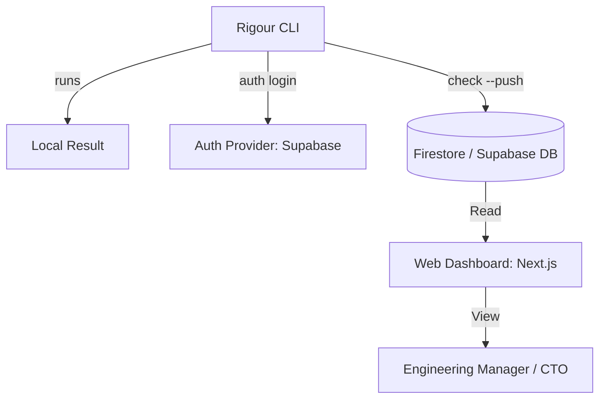

# 🌐 Rigour Cloud: Technical & Business Plan

To scale Rigour into a multi-user platform, we need to bridge the gap between **Local Enforcement** and **Global Visibility**.

## 🎯 Architecture: Local-First, Cloud-Synced

Users should never be forced to log in to use the core CLI. However, logging in unlocks the **Enterprise Visibility Layer**.

## 🛠️ Tech Stack Recommendation

### 1. Database: **Supabase** (PostgreSQL + Auth)
- **Why?**: 
  - Superior relational support for "Teams" and "Organizations".
  - Powerful Auth with zero maintenance.
  - Row Level Security (RLS) is perfect for multi-tenant data safety.
  - **Free Tier**: Very generous (500MB DB, 50,000 monthly active users).

### 2. Alternative: **Firestore** (Google Cloud)
- **Why?**:
  - Better for unstructured "Report JSON" blobs.
  - Scaling is effortless.
  - Seamless integration with Google Cloud Functions for "Drift Alerts".
  - **Free Tier**: 1GB storage, NoSQL flexibility.

## 📈 Roadmap (Phase S)

### [S.1] Identity Handshake
- Implement `rigour auth login`.
- Uses a browser-based OAuth flow that returns a JWT.
- Tokens stored locally in `~/.rigour/credentials.json`.

### [S.2] The "Global Pulse"
- Modify `rigour check` to accept a `--push` flag.
- Serializes the local report and sends it to `api.rigour.builders`.
- Automatically calculates "Organization Health" across all active repos.

### [S.3] Architectural Drift Detection
- If a repo was passing but now fails due to a "Layer Violation", trigger a **Slack/Email notification**.
- This turns Rigour from a "Gate" into an "Intelligent Sentry".

## 💎 Monetization Strategy (Premium)
- **Free**: 1 Repo, 1 User, 7-day data retention.
- **Team**: $29/mo — Unlimited repos, 5 users, Slack integration.
- **Enterprise**: $499/mo — SSO, Custom Gate Enforcement, Year-long retention.

---
**Verdict**: I recommend **Supabase** for its Auth speed and SQL power, but we will store the raw Report JSON in **Firestore** for cost-effective scale.
